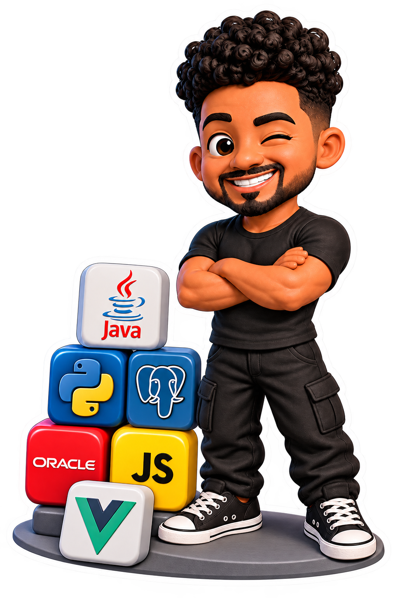

# Olá! Eu sou o Anderson Silva 👋

### Desenvolvedor Java | Engenharia de Dados | SQL | Python

---

## 👨‍💻 Sobre mim

Sou desenvolvedor com foco em Java e estou expandindo minha carreira para Engenharia de Dados.

- 🎓 Engenharia de Computação
- 📊 Especialização em Análise de Dados e BI
- 🚀 Estudando Engenharia de Dados
- ☕ Desenvolvedor Java
- 🗄️ SQL, Oracle e PostgreSQL
- 🐍 Python para dados

## 🚀 Tecnologias que eu uso no meu dia a dia

 

